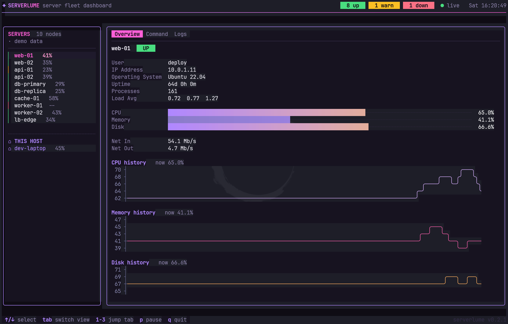

# ✦ serverlume

**A [k9s](https://k9scli.io/)-style terminal dashboard for your SSH fleet** — point it
at `~/.ssh/config` and it discovers your hosts, connects, and shows real
CPU/memory/disk/network numbers pulled straight from `/proc`, agentlessly.
No daemon to install, no port to open, nothing on the target beyond a shell
it already has.

[](https://goreportcard.com/report/github.com/steamedeo/serverlume)
[](https://github.com/steamedeo/serverlume/actions)
[](https://pkg.go.dev/github.com/steamedeo/serverlume)
[](./go.mod)
[](https://github.com/steamedeo/serverlume/tags)
[](./LICENSE)



> serverlume started as an exploration of how far a terminal UI can go
> toward looking like a modern web dashboard, all in true-color ANSI, and
> grew into an actually-useful agentless fleet monitor. See
> [Bringing your own data](#bringing-your-own-data) for exactly what's real
> vs. simulated today — short version: the server list, the metrics, and the
> logs are all real for Linux hosts.

## Why

Most fleet dashboards mean installing something — an agent, an exporter, a
sidecar. serverlume doesn't. If you can already run `ssh myhost`, serverlume
can already monitor it: it reads your existing `~/.ssh/config`, connects
with your existing keys, and reads `/proc` the same way any shell on the box
already can. Same trust boundary as your terminal, same access you already
have — just visualized.

## Features

- **Fleet discovery from `~/.ssh/config`** — every concrete `Host` alias
  becomes a monitored server, no separate inventory file to maintain. No
  config found? Falls back to a small demo fleet so there's always something
  to look at.
- **Live metrics over SSH, agentlessly** (Linux hosts, for now) — real
  CPU/memory/disk/network/load numbers via a single `/proc` read per poll,
  the same technique Ansible uses for fact-gathering. Persistent per-host
  connections, reused across polls rather than reconnected every time.
- **This host** — your own machine gets a divider-separated entry with real
  local metrics (via [gopsutil](https://github.com/shirou/gopsutil)), kept
  visually and functionally apart from the fleet you're SSHing into.
- **Overview tab** — user, IP, OS, uptime, load average, gradient gauges for
  CPU/memory/disk, network throughput, and auto-scaled history line charts
  so a metric that only wobbles a couple of points still reads as motion,
  not a flat line.
- **Command tab** — run one-off commands on a host over the same live SSH
  connection, real stdout/stderr, independent input and scrollback per host.
- **Logs tab** — a real event feed: every SSH connect, disconnect, poll, and
  error, as they actually happen. Nothing simulated.
- Smooth true-color (24-bit) gradients throughout, computed in LUV color
  space for a look that doesn't feel like a typical 16-color terminal app.

## Install

```sh
go install github.com/steamedeo/serverlume@latest
```

Requires a terminal with 24-bit (true color) support for the intended look;
most modern terminals (Windows Terminal, iTerm2, Kitty, WezTerm, Alacritty,
GNOME Terminal, ...) support this out of the box.

### Build from source

```sh
git clone https://github.com/steamedeo/serverlume.git
cd serverlume
go build -o serverlume .
./serverlume
```

## Usage

Just run `serverlume` — it reads `~/.ssh/config` on startup, no flags
needed.

| Key             | Action                                              |
| --------------- | ---------------------------------------------------- |
| `↑` / `k`       | Select previous server                                |
| `↓` / `j`       | Select next server                                     |
| `Tab`           | Next detail tab                                        |
| `Shift+Tab`     | Previous detail tab                                    |
| `1` – `3`       | Jump to a specific tab (Overview / Command / Logs)     |
| `p`             | Pause / resume live updates                            |
| `q` / `Ctrl+C`  | Quit                                                    |

On the Command tab, typing goes straight into that host's command line —
press `Enter` to run it, `Backspace` to edit. Arrow-key server navigation
and tab-switching still work normally while typing.

## Bringing your own data

The fleet **list** is real: [`ssh.go`](./ssh.go) parses `~/.ssh/config` (via
[kevinburke/ssh_config](https://github.com/kevinburke/ssh_config)) and turns
each concrete `Host` alias into a server entry, resolving
`HostName`/`User`/`Port`/`IdentityFile` through the config's normal matching
rules (including values inherited from a catch-all `Host *` block).

Per-host **metrics** are real too, for Linux hosts: [`sshpoll.go`](./sshpoll.go)
connects to each one directly over SSH (via
[golang.org/x/crypto/ssh](https://pkg.go.dev/golang.org/x/crypto/ssh), not a
shelled-out `ssh` binary) and runs a single read of `/proc/stat`,
`/proc/meminfo`, `/proc/loadavg`, `/proc/net/dev`, `/proc/uptime`, and `df`,
the same agentless approach tools like Ansible use for fact-gathering —
nothing is installed on the target, and the connection is reused across
polls (every 4s) rather than reconnected each time. Two consecutive samples
turn the raw `/proc/stat` counters into a real CPU percentage and
`/proc/net/dev` counters into a real throughput rate.

Current limits worth knowing about:

- **Linux targets only.** A remote Windows host would need a different
  transport (WinRM) and a different set of counters (PowerShell/WMI) —
  a reasonable follow-up, not implemented yet.
- **Key-based auth only, no passphrase prompting.** Signing keys are pulled
  from a running `ssh-agent` (via `SSH_AUTH_SOCK` — works on Linux/macOS/WSL,
  typically not on native Windows) and/or the config's `IdentityFile`
  entries (or the usual `~/.ssh/id_ed25519` / `id_ecdsa` / `id_rsa`
  defaults); passphrase-protected keys that aren't in the agent are skipped,
  since there's nowhere in a TUI redraw loop to prompt for one.
- **Host keys are verified against `~/.ssh/known_hosts`**, the same file
  `ssh` itself trusts — deliberately not skipped, since silently accepting
  any host key would defeat the point of using SSH. `ssh <host>` once by
  hand first if a host isn't in there yet. The handshake is also restricted
  to whichever key type(s) are already pinned for that host, the same way
  `ssh` itself behaves — without that, a host pinned under only one key type
  can get flagged as a false "key mismatch" if Go's default negotiation
  picks a different (but otherwise valid) type the server also offers.
- A poll that fails (unreachable host, auth failure, timeout) marks the
  server `down` and leaves its last-known numbers in place rather than
  blanking them.
- The **Command tab** is one-shot exec, not an interactive shell — no
  `vim`, `top`, or state (`cd`, env vars) carried between commands, since
  each run is its own SSH session.

[`host.go`](./host.go) still shows the pattern for "This host": it reads live
data for the local machine via [gopsutil](https://github.com/shirou/gopsutil)
on every tick instead of over SSH, since it's already local. The `server`
struct and the rest of the UI don't need to change for either data source.

## Tech stack

- [Bubble Tea](https://github.com/charmbracelet/bubbletea) — TUI framework
- [Lip Gloss](https://github.com/charmbracelet/lipgloss) — styling and layout
- [asciigraph](https://github.com/guptarohit/asciigraph) — line charts
- [go-colorful](https://github.com/lucasb-eyer/go-colorful) — gradient color blending
- [kevinburke/ssh_config](https://github.com/kevinburke/ssh_config) — SSH client config parsing
- [golang.org/x/crypto/ssh](https://pkg.go.dev/golang.org/x/crypto/ssh) — SSH client for live remote polling
- [gopsutil](https://github.com/shirou/gopsutil) — local host metrics

## Contributing

Issues and pull requests are welcome. Please run `gofmt`, `go vet ./...`,
and `go test ./...` before submitting — CI runs the same checks.

## License

[MIT](./LICENSE)
